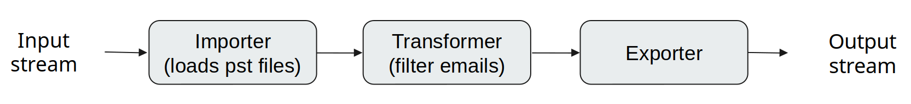

# DocWire SDK

DocWire SDK: Award-winning modern data processing in C++17/20. SourceForge Community Choice & Microsoft support. AI-driven processing. Supports nearly 100 data formats, including email boxes and OCR. Boost efficiency in text extraction, web data extraction, data mining, document analysis. Successor to DocToText library.

Offline processing possible for security and confidentiality.

Explore the latest updates, contribute to the community, and find the most up-to-date information on our [GitHub project page](https://github.com/docwire/docwire).

## Table Of Contents
- [The Goal](#the-goal)
- [Features](#features)
- [Examples](#examples)
- [Awards](#awards)
- [Installation](#installation)
- [API documentation](#api-documentation)
- [License](#license)
- [Authors](#authors)
- [External links](#external-links)

<a name="the-goal"></a>
## The Goal

Welcome to the future of data processing with DocWire SDK, the natural successor to the renowned DocToText library! Our ongoing mission is to continuously empower developers and businesses by enhancing our modern C++ data processing framework, supercharging productivity, and simplifying development.

**For Developers:** If you're familiar with DocToText, you're in for a significant upgrade. We're committed to staying at the forefront of modern C++ dialects. With C++17 and soon C++20, we will continue to provide advanced features, including ranges and concurrency. Our toolkit will evolve to handle an even wider range of data processing tasks, including robust HTTP capabilities, comprehensive network APIs, and efficient web data extraction. We understand that today's developers require comprehensive solutions for text extraction, data conversion, data scraping, and data mining, all seamlessly integrated into their C++ applications.

**For Businesses:** DocWire SDK is not just a successor; it's a leap forward. It remains your trusted solution for tackling complex data processing tasks. Our support for diverse document formats, like PDF, DOC, XLS, and more, will become even more comprehensive. We will further enhance our ability to extract valuable insights from email boxes, databases, websites, and leverage the latest AI features.

Our goal for the future is to provide a truly versatile and comprehensive set of features that enable you to extract and transform text, images, formatting, and metadata more efficiently. We will continue to support various import formats and expand our export options. As we venture into full-fledged HTTP methods and network capabilities, we aim to empower you to integrate seamlessly with web services, extract online data, and perform robust data processing.

We're not stopping at our current platforms; DocWire SDK will expand its cross-platform support to include other popular operating systems and can be seamlessly embedded into your application. 

As we move forward, our focus remains on simplifying data processing, reducing development time and costs, and minimizing risks. Join us on this exciting journey, where innovation, practicality, and the power of AI continue to redefine data processing. Explore the limitless possibilities of DocWire SDK today and into the future, and experience the significant enhancements that set it apart from its predecessor, DocToText.

<a name="features"></a>
## Features

- Able to extract/import and export text, images, formatting, and metadata along with annotations
- Data can be transformed between import and export (filtering, aggregating, etc)
- Equipped with multiple importers:
    - Microsoft Office new Office Open XML (OOXML): DOCX, XLSX, PPTX files
    - Microsoft Office old binary formats: DOC, XLS, XLSB, PPT files
    - OpenOffice/LibreOffice Open Document Format (ODF): ODT, ODS, ODP files
    - Portable Document Format: PDF files
    - Webpages: HTML, HTM, and CSS files
    - Rich Text Format: RTF files
    - Email formats with attachments: EML files, MS Outlook PST, OST files
    - Image formats: JPG, JPEG, JFIF, BMP, PNM, PNG, TIFF, WEBP with OCR capabilities
    - Apple iWork: PAGES, NUMBERS, KEYNOTE files
    - ODFXML (FODP, FODS, FODT)
    - Archives (ZIP, TAR, RAR, GZ, BZ2, XZ)
    - Scripts and source codes: ASM, ASP, ASPX, BAS, BAT, C, CC, CMAKE, CS, CPP, CXX, D, F, FPP, FS, GO, H, HPP, HXX, JAVA, JS, JSP, LUA, PAS, PHP, PL, PERL, PY, R, SH, TCL, VB, VBS, WS files
    - XML format family: XML, XSD, XSL files
    - Comma-Separated Values: CSV files
    - Other structured text formats: JSON, YML, YAML, RSS, CONF files
    - Other unstructured text formats: MD, LOG files
    - DICOM (DCM) as an additional commercial plugin
- Equipped with multiple exporters:
    - Plain text: Easily extract and export text content.
    - HTML: Export content in HTML format for web use.
    - CSV: Export data to Comma-Separated Values format.
    - XLSX and more are coming: Additional export formats for diverse use cases.
- HTTP::Post transformer: Facilitate seamless communication with external HTTP APIs or services, enabling data exchange and integration with external systems.
- Integration with OpenAI API, including transformers like:
    - TranslateTo: Translate text to different languages.
    - Summarize: Generate summarized content from longer texts.
    - ExtractEntities: Extract entities and key information from text.
    - Classify: Perform text classification and categorization.
    - ExtractKeywords: Identify and extract keywords from text.
    - DetectSentiment: Analyze and detect sentiment in text.
    - AnalyzeData: Perform data analysis on text content.
    - Chat: Conduct chat-based interactions and conversations.
- Equipped with a high-grade, scriptable, and trainable OCR that has LSTM neural networks-based character recognition
- Incremental parsing returning data as soon as they are available
- Cross-platform: Linux, Windows, MacOSX, and more to come
- Can be embedded in your application (SDK)
- Can be integrated with other data mining and data analytics applications
- Parsing process can be easily designed by connecting objects with the pipe `|` operator into a chain
- Parsing chain elements communicate based on Boost Signals
- Custom parsing chain elements can be added (importers, transformers, exporters)
- Small binaries, fast native C++ code

<a name="examples"></a>
## Examples

Parse file in any format (Office, PDF, mail, etc) having its path, export to plain text and print to standard output:

```cpp
#include "docwire.h"

int main(int argc, char* argv[])
{
  if (argc > 1)
  {
    using namespace docwire;
    Input(argv[1]) |
      Importer() |
      PlainTextExporter() |
      Output(std::cout);
  }
  return 0;
}
```

Parse file in any format (Office, PDF, mail, etc) having stream, export to HTML and save to file stream:

```cpp
#include "docwire.h"
#include <fstream>

int main(int argc, char* argv[])
{
  using namespace docwire;

  Input(std::ifstream(argv[1], std::ios_base::in|std::ios_base::binary))
    | Importer()
    | HtmlExporter()
    | Output(std::ofstream("output.html"));

  return 0;
}
```

Parse all files in any format inside archives (ZIP, TAR, RAR, GZ, BZ2, XZ) recursively:

```cpp
#include "docwire.h"

int main(int argc, char* argv[])
{
  if (argc > 1)
  {
    using namespace docwire;
    Input(argv[1]) |
      DecompressArchives() |
      Importer() |
      PlainTextExporter() |
      Output(std::cout);
  }
  return 0;
}
```

Reusing single parsing chain to parse multiple input files:

```cpp
#include "docwire.h"
#include <fstream>

int main(int argc, char* argv[])
{
  using namespace docwire;
  auto chain = Importer()
             | PlainTextExporter()
             | Output(std::cout);  // create a chain of steps to parse a file
  for (int i = 1; i < argc; ++i)
  {
    std::cout << "Parsing file " << argv[i] << std::endl;
    Input(std::ifstream(argv[i], std::ios_base::in|std::ios_base::binary)) | chain; // set the input file as an input stream
    std::cout << std::endl;
  }

  return 0;
}
```

Using transformer to filter out emails (eg. from Outlook PST mailbox) with subject containing "Hello":

```cpp
#include "docwire.h"

int main(int argc, char* argv[])
{
  using namespace docwire;
  Input(argv[1]) |
  Importer()
    | TransformerFunc([](Info &info) // Create an importer from file name and connect it to transformer
      {
        if (info.tag_name == StandardTag::TAG_MAIL) // if current node is mail
        {
          auto subject = info.getAttributeValue<std::string>("subject"); // get the subject attribute
          if (subject) // if subject attribute exists
          {
            if (subject->find("Hello") != std::string::npos) // if subject contains "Hello"
            {
              info.skip = true; // skip the current node
            }
          }
        }
      })
    | PlainTextExporter() // sets exporter to plain text
    | Output(std::cout);
  return 0;
}
```



Joining transformers to filter out emails (eg. from Outlook PST mailbox) with subject "Hello" and limit the number of mails to 10:

```cpp
#include "docwire.h"

int main(int argc, char* argv[])
{
  using namespace docwire;
  Input(argv[1]) |
  Importer() |
    TransformerFunc([](Info &info) // Create an input from file name, importer and connect them to transformer
    {
      if (info.tag_name == StandardTag::TAG_MAIL) // if current node is mail
      {
        auto subject = info.getAttributeValue<std::string>("subject"); // get the subject attribute
        if (subject) // if subject attribute exists
        {
          if (subject->find("Hello") != std::string::npos) // if subject contains "Hello"
          {
            info.skip = true; // skip the current node
          }
        }
      }
    }) |
    TransformerFunc([counter = 0, max_mails = 1](Info &info) mutable // Create a transformer and connect it to previous transformer
    {
      if (info.tag_name == StandardTag::TAG_MAIL) // if current node is mail
      {
        if (++counter > max_mails) // if counter is greater than max_mails
        {
          info.cancel = true; // cancel the parsing process
        }
      }
    }) |
    PlainTextExporter() | // sets exporter to plain text
    Output(std::cout);
 return 0;
}
```

<a name="awards"></a>
## Awards

- SourceForge Community Choice (2023) - project has qualified for this award out of over 500,000 open source projects on SourceForge
- Microsoft for Startups grant (2022) - project was selected by Microsoft to accelerate its grow by providing Expert Guidance, development tools, Azure and GitHub cloud infrastructure and OpenAI machine learning utilities

<a name="installation"></a>
## Installation

### Why Choose vcpkg for DocWire SDK Installation?
DocWire has embraced vcpkg as the preferred installation method for several compelling reasons:
- **Microsoft's Trusted Solution:** vcpkg is a package manager developed and backed by Microsoft, ensuring reliability, ongoing support, and compatibility.
- **Cross-Platform Simplicity:** With vcpkg, DocWire installation becomes a breeze on Windows, Linux, and macOS, providing a unified and hassle-free experience.
- **Effortless Dependency Management:** vcpkg takes care of resolving and installing dependencies automatically, reducing manual configuration efforts for developers.
- **Swift Binary Package Deployment:** The availability of pre-built binary packages in vcpkg accelerates installation, minimizing the need for time-consuming manual compilation.
- **Seamless CMake Integration:** vcpkg seamlessly integrates with the CMake build system, simplifying the incorporation of DocWire into CMake-based projects.
By selecting vcpkg, DocWire ensures that programmers benefit from a trusted, user-friendly, and well-supported solution that guarantees a smooth installation experience.

### Installation Steps
1. **Install vcpkg:**
If you haven't already installed vcpkg, you can do so by following the instructions in the [vcpkg documentation.](https://github.com/microsoft/vcpkg).
2. **Integrate vcpkg:**
Ensure that vcpkg is integrated with your development environment by running the following command:
```
vcpkg integrate install
```
3. **Clone the DocWire Repository:**
Clone the DocWire repository from GitHub if you haven't already:
```
git clone https://github.com/docwire/docwire.git
```
4. **Set Up Overlay:**
To configure vcpkg to recognize the DocWire overlay, use the following command:
```
vcpkg overlay add docwire/ports
```
This command ensures that vcpkg adds the DocWire overlay for subsequent installations.

5. **Install DocWire:**
Now that the overlay is set up, you can use vcpkg to install the DocWire library:
```
vcpkg install docwire
```
6. **Download Binary Archives (Alternative):**
As an alternative to building from source, users can also download pre-built binary archives that contain the results of the vcpkg export command for DocWire. These archives can be found in the "Releases" section of the DocWire GitHub repository.
7. **Link with Your Project:**
After installation, configure your project settings to link with the DocWire library and its dependencies. You can use one of the following example CMake commands to build your project:
- Using vcpkg toolchain file from downloaded prebuilt binaries:
```
cmake -DCMAKE_TOOLCHAIN_FILE=docwire/scripts/buildsystems/vcpkg.cmake ..
```
- Using vcpkg toolchain file from the vcpkg repository:
```
cmake -DCMAKE_TOOLCHAIN_FILE=/path/to/vcpkg/scripts/buildsystems/vcpkg.cmake ..
```

### Usage and Conclusion
You're all set! You've successfully installed the DocWire library using vcpkg. You can now use the DocWire library in your code to perform text extraction from documents. 

### Compatibility Note
Please note that DocWire is currently compatible with vcpkg tagged as version 2023.08.09. While this version is recommended for use, be aware that updates may become available in the near future. Supported triplets are: x64-linux-dynamic, x64-windows and x64-osx-dynamic.

<a name="api-documentation"></a>
## API Documentation
The API documentation for the DocWire SDK/library is readily available in various formats to assist you in seamlessly integrating it into your projects. Whether you prefer reading detailed doxygen-style documentation, accessing it through binary packages, or installing it via package managers like Vcpkg, we've got you covered.

### ReadTheDocs - Doxygen Format
Our API documentation is hosted on [ReadTheDocs](https://docwire.readthedocs.io/), presented in the widely recognized and developer-friendly Doxygen format. This comprehensive documentation provides insights into the functionality, usage, and features of the DocWire library. You can explore it at your own pace to better understand how to harness the power of DocWire within your applications.

### GitHub Releases

If you're looking for a more direct way to access the documentation, you can find it bundled with our binary packages in the [GitHub Releases](https://github.com/docwire/docwire/releases) section. Simply download the appropriate release for your platform, and you'll have the API documentation readily available alongside the library itself.

### Vcpkg Package Manager

For users who prefer to manage their dependencies using Vcpkg, we've made sure that our API documentation is included with the packages you install. This means you can access the same doxygen-style documentation seamlessly as you manage and integrate DocWire into your C++ projects.

### Consistency Across Platforms

It's worth noting that no matter where you choose to access our API documentation—whether through ReadTheDocs, GitHub Releases, or Vcpkg—you will find the same comprehensive doxygen-style documentation. This ensures a consistent and reliable resource for understanding and utilizing the DocWire library.

### Why ReadTheDocs?

You might wonder why we chose ReadTheDocs to host our documentation. While some might see this as a marketing signal, we believe it's a practical choice for several reasons:

1. **Accessibility**: ReadTheDocs provides an easy-to-navigate platform that ensures our documentation is readily accessible to all users.

2. **Versioning**: We can maintain multiple versions of our documentation, ensuring that you can always find the information relevant to your specific library version.

3. **Automation**: ReadTheDocs allows us to automate the documentation publishing process, ensuring that you have the latest documentation whenever you need it without delay.

We believe in making the integration of DocWire as smooth as possible, and providing our documentation through ReadTheDocs is just one way we're committed to simplifying your experience.

Explore the documentation, experiment with the library, and feel free to reach out if you have any questions or feedback. We're here to support you on your journey with DocWire.

<a name="license"></a>
## License

Product is double licensed:

- It can be used in open source projects under the terms of the GNU General Public License, version 2
- It can be used in commercial projects under the terms of commercial license agreement

Please contact SILVERCODERS (http://silvercoders.com) for a commercial license for DocWire SDK.

Please keep in mind that any attempt to circumvent the terms of the GNU General Public License by employing wrappers, pipelines,
client/server protocols, etc. is illegal. You must purchase a commercial license if your program, which is distributed under a license
other than the GNU General Public License version 2, directly or indirectly calls any portion of this code.
Simply stop using the product if you disagree with this viewpoint.

<a name="authors"></a>
## Authors

- [Silvercoders Ltd](https://silvercoders.com)
- [DocWire LLC](https://docwire.io)

<a name="external-links"></a>
## External links

- [Project homepage - DocWire](https://docwire.io)
- [Cloud API on RapidAPI](https://rapidapi.com/docwire-docwire-default/api/docwire-doctotext)
- [SourceForge project page](https://sourceforge.net/projects/doctotext)
- [LinkedIn page](https://www.linkedin.com/company/docwire-it-services-consulting)
- [Project homepage - Silvercoders](https://silvercoders.com/en/products/doctotext)
