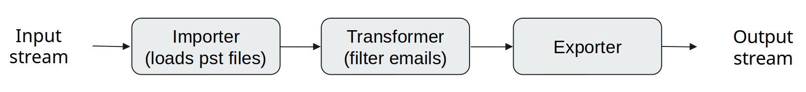

# DocWire SDK

**Deterministic, auditable, and secure data processing in C++20.**

**On-premise by default. No compromises on computational speed.**

<a name="what-is-docwire-sdk"></a>
## What is DocWire SDK?

DocWire SDK is an embeddable software development kit (SDK): a set of reusable C++ building blocks for building data-processing pipelines and infrastructure. It is not a single parser, ETL service, or cloud tool. You compile it into your own application and control how data flows through it.

DocWire treats data processing in the broad sense used by modern data-protection frameworks: collection, organisation, structuring, storage, adaptation, alteration, retrieval, consultation, use, disclosure by transmission, combination, restriction, erasure, and destruction. The goal is for DocWire components to cover the complete data-processing life cycle. Parts of that life cycle are available today; the rest are defined in the roadmap.

### What you can do with DocWire today

- **Ingest** files, email boxes, archives, HTTP request payloads, JSON, XML, CSV, and more.
- **Normalize and structure** raw input using format detection, parsers, OCR, document element extraction, and structured-data handling.
- **Transform** data with filters, translations, summaries, classification, entity extraction, sentiment analysis, embeddings, and optional local or cloud AI steps.
- **Export or act** through plain text, HTML, CSV, metadata, stdout, files, HTTP POST, or the built-in HTTP server.
- **Compose pipelines** with `operator|` and embed them directly into your own C++20 application.
- **Run on-premise by default**; cloud processing is used only when you explicitly add a cloud pipeline step.

### Built on three principles

1. **It is an SDK.** Reusable, embeddable components—not a closed black-box product.
2. **It is data infrastructure.** The same pipeline model is intended to cover documents, structured records, streams, sensors, and hardware effects.
3. **It is mechanically sympathetic.** The design follows DocWire’s engineering principles of predictability, auditability, edge optimization, and graceful degradation.

DocWire is production-tested today and is continuously extending its architectural core.

## Table of Contents

- [What is DocWire SDK?](#what-is-docwire-sdk)
- [Manifesto](#manifesto)
- [Engineering Principles](#engineering-principles)
- [Why DocWire and Key Benefits](#why-docwire-and-key-benefits)
- [Features](#features)
- [Roadmap](#roadmap)
- [API Concept](#api-concept)
- [Examples](#examples)
- [Installation](#installation)
- [Versioning](#versioning)
- [Logging](#logging)
- [Error handling: robust and secure](#error-handling-robust-and-secure)
- [API documentation](#api-documentation)
- [Console application](#console-application)
- [License](#license)
- [Authors](#authors)
- [External links](#external-links)

<a name="manifesto"></a>
## Manifesto

DocWire exists because modern data processing often trades predictable execution, memory ownership, and auditability for framework convenience.

Most data processing stacks are built for the easy case: clean inputs, unlimited cloud resources, and a human in the loop when something breaks. The real world looks different:

- A **medical wearable** cannot drain its battery parsing a malformed data stream.
- A **compliance system** cannot hallucinate an audit trail.
- A **trading platform** cannot tolerate a garbage-collection pause at the wrong moment.
- An **autonomous system** cannot crash because of an undocumented proprietary file format.

These are not edge cases. They are the normal operating conditions of any system that runs in production, at scale, in a regulated or time-critical environment. DocWire SDK is built for exactly these conditions.

We are building a toolkit with **mechanical sympathy** for the hardware it runs on:

- **Predictability** – deterministic execution, no hidden allocations.
- **Auditability** – visible data flow and injected audit output.
- **Edge optimization** – zero-copy pipelines, allocator-aware memory.
- **Graceful degradation** – malformed input returns errors, not crashes.

[Read the full manifesto →](https://docwire.readthedocs.io/en/latest/manifesto.html)
[Read the engineering rules →](https://docwire.readthedocs.io/en/latest/coding_guidelines.html)

<a name="engineering-principles"></a>
## Engineering Principles

### Predictability

DocWire rejects hidden allocations, background work, and implicit global state. Pipelines are built around `operator|` and are designed for deterministic execution. Today, core pipeline flows use this model, and we are migrating all existing format handlers to the same rules.

### Auditability

DocWire gives developers control over diagnostics and audit output. The SDK avoids hidden global state and provides structured logging and configurable sinks. A dependency-injected `Audit` interface is under active development.

### Edge Optimization

Non-owning views already avoid copies across many pipeline boundaries. The architecture is moving toward fully injected allocator policies, including arena-backed low-latency allocation, while retaining standard heap allocator support.

### Graceful Degradation

Untrusted input is normalized at SDK boundaries. Malformed or encrypted data is reported as an error without crashing the host process. Structural validation of incoming data is always required; it can never be disabled by optimized build modes.

<a name="why-docwire-and-key-benefits"></a>
## Why DocWire and Key Benefits

**For Developers:** DocWire provides a flexible C++ API to build data processing pipelines. It supports custom chain elements and integrates with existing codebases.

**Optimized for NLP and AI Projects:** DocWire includes structured document element extraction, content filtering, and pluggable message transformations. Planned enhancements include tokenization/detokenization, output sanitization, and customizable data cleaning pipelines. It can prepare datasets for AI training, inference, and embedding workflows.

**Enhanced AI/NLP Integration:** DocWire supports structured document element extraction. Semantic partitioning and context-aware chunking are under active development. Extracted elements can be used to generate embeddings for semantic search, retrieval augmented generation (RAG), document clustering, and similarity analysis.

**The layer your AI pipeline is missing:** Raw documents are rarely LLM-ready. Dirty PDFs, malformed email archives, legacy Office files, OCR scans, and mixed-format datasets must be normalized before they can be embedded, chunked, or summarized. DocWire ingests and structures that unstructured input into clean, typed document elements—on-premise by default, with structured logging today and an injected audit interface under active development—and optional cloud AI steps.

**For Businesses:** DocWire processes unstructured, semi-structured, and structured data from diverse sources including PDF, Office documents, email boxes, web services, JSON, XML, CSV, and more. It integrates cloud and local AI models as explicit processing steps. Direct database, ERP, message-queue, and industrial-stream connectors are planned extensions.

**Input and Output Sources:** Email boxes, local filesystem, structured files such as JSON, XML, and CSV, and HTTP/web services can be connected to DocWire pipelines today. Cloud drives, ERP systems, relational databases, message queues, and industrial data streams are planned extensions. A pipeline can end in an exporter or in an effect, such as posting data, publishing a message, sending an email, or commanding hardware. Cloud AI providers are supported through explicit pipeline integrations, not hidden background calls.


<a name="features"></a>
## Features

Features marked **(planned)** are on the public roadmap and may not be fully available in the current release.

- **Local-first and privacy-preserving data processing** - the goal is for every processing stage to support an on-premise implementation. Today, parsing, OCR, local document AI, and local text embeddings can run fully offline. A few AI capabilities, such as image/audio understanding and the largest cloud LLM models, are available only through explicit OpenAI integration. No data is sent to a cloud service unless a cloud transformer is explicitly added to the pipeline. Hybrid privacy workflows, such as local anonymization before optional cloud processing, are planned.
- Able to extract/import and export **text, images, formatting, and metadata along with annotations**
- **Handles unstructured and structured payloads**: documents, images, web content, JSON, XML, CSV, and other structured or semi-structured formats can be processed in the same pipeline model.
- **Data can be transformed** between import and export (filtering, aggregating, translation, text classification, sentiment analysis, named entity recognition etc).

- **Equipped with multiple parsers**:
    - Microsoft Office new Office Open XML (OOXML): DOCX, XLSX, PPTX files
    - Microsoft Office old binary formats: DOC, XLS, XLSB, PPT files
    - OpenOffice/LibreOffice Open Document Format (ODF): ODT, ODS, ODP files
    - Portable Document Format: PDF files
    - Webpages: HTML, HTM, and CSS files
    - Rich Text Format: RTF files
    - Email formats with attachments: EML files, MS Outlook PST, OST files
    - Image formats: JPG, JPEG, JFIF, BMP, PNM, PNG, TIFF, WEBP with OCR capabilities in more than 100 languages and multiple languages in single picture.
    - Apple iWork: PAGES, NUMBERS, KEYNOTE files
    - ODFXML (FODP, FODS, FODT)
    - Archives (ZIP, TAR, RAR, GZ, BZ2, XZ)
    - Scripts and source codes: ASM, ASP, ASPX, BAS, BAT, C, CC, CMAKE, CS, CPP, CXX, D, F, FPP, FS, GO, H, HPP, HXX, JAVA, JS, JSP, LUA, PAS, PHP, PL, PERL, PY, R, SH, TCL, VB, VBS, WS files
    - XML format family: XML, XSD, XSL files
    - Comma-Separated Values: CSV files
    - Other structured text formats: JSON, YML, YAML, RSS, CONF files
    - Other unstructured text formats: MD, LOG files
    - DICOM (DCM) as an additional commercial library

- **Equipped with multiple exporters**:
    - Plain text: Easily extract and export text content.
    - HTML: Export content in HTML format for web use.
    - CSV: Export data to Comma-Separated Values format.
    - XLSX and more are coming: Additional export formats for diverse use cases.

- **Fast and accurate file format detection**: Leveraging file signatures, file name extensions, content analysis, and MIME type recognition, the DocWire SDK automatically detects the format of any file. This ensures that the appropriate parser is selected for processing. With its ability to identify various formats, DocWire SDK serves as a versatile tool for numerous file processing tasks. For more information, see the following functions and classes: [content_type::detector](https://docwire.readthedocs.io/en/latest/classdocwire_1_1content__type_1_1detector.html) and [content_type::detect](https://docwire.readthedocs.io/en/latest/namespacedocwire_1_1content__type.html#ab8fcce329158e74aed1c402df93fa4e4). [You can find example how to perform file type detection (with or without document processing) here](https://docwire.readthedocs.io/en/latest/file_type_determination_8cpp-example.html).
Additionally, the SDK provides functionality to convert a MIME type back to a file extension via `content_type::by_file_extension::to_extension`, which can be useful in scenarios where a file name is needed.

- **Modern C++20 XML Parsing**: A new, expressive, and safe API for parsing XML documents. It features a single-pass, forward-only reader and utilizes C++20 ranges and views for efficient and elegant node filtering and manipulation. [You can find example how to parse XML documents here](https://docwire.readthedocs.io/en/latest/xml_parsing_example_8cpp-example.html).

- **Configurable Safety Policies**: The SDK provides `strict` and `relaxed` safety policies for XML-based parsers, with other components to follow. In `strict` mode, developer contract violations throw typed exceptions through the current error framework. In `relaxed` mode, trusted developer checks are compiled out for zero overhead. Relaxed mode should be used only for trusted XML input; untrusted input should use strict validation. The SDK is evolving toward injectable error policies that will also support `docwire::expected`-based propagation.

- **Llama.cpp Integration** (optional `local-ai-llama` feature): The SDK integrates seamlessly with llama.cpp, allowing users to select a model of their choice and integrate it within the workflow using the `llama` wrapper provided in the SDK. This feature is optional and must be enabled at build time.

- **Optional powerful IBM Granite 4.0 1B model** (via `local-ai-model-granite` feature): This compact yet capable language model can be installed as an optional feature for a wide range of natural language processing tasks, including text extraction, classification, question answering, summarization, and more. It runs via **llama.cpp** and is optimized for CPU inference on lower-end desktops without GPU acceleration.

- **Flan-t5-large model** (via `local-ai-ct2` feature): This state-of-the-art transformer-based model is designed for a wide range of natural language processing tasks, including text translation, question answering, summarization, text generation, and more. It has been trained on a diverse range of data sources and can handle complex linguistic phenomena such as word order, syntax, and semantics. The model's versatility and ability to perform multiple tasks make it a valuable addition to the DocWire SDK, allowing developers to leverage its capabilities for a variety of NLP tasks within their applications. It is provided as part of the optional `local-ai-ct2` feature and is optimized to run with decent speed on lower-end desktops and mobile devices without GPU acceleration and consuming less than 1 GB of memory.

- **Powerful multilingual-e5-small model** (via `local-ai-ct2` feature): This powerful and efficient multilingual text embedding model is designed to generate high-quality vector representations (embeddings) for text in over 100 languages. These embeddings are crucial for a wide range of NLP tasks, including semantic search, retrieval-augmented generation (RAG), text clustering, and similarity comparison. The `multilingual-e5-small` model is optimized for performance, making it suitable for applications where both speed and accuracy are important. It is included with the `local-ai-ct2` feature.

- **Support for running locally more powerful AI models using CTranslate2 technology** (included in `local-ai-ct2` feature): This technology is designed to be highly scalable and efficient on CPU and GPU, enabling efficient deployment of language models on resource-constrained devices. Quantization allows maintaining accuracy with smaller model sizes making it suitable for desktop and mobile applications. Parallel and asynchronous execution enables efficient utilization of hardware resources.

- **Equipped with a high-grade, scriptable, and trainable local OCR** that has LSTM neural networks-based character recognition OCR capabilities in more than 100 languages and multiple languages in single picture.

- HTTP::post transformer: Facilitate **seamless communication with external HTTP APIs or services**, enabling data exchange and integration with external systems.

- HTTP Server: **Host your own data processing pipelines as HTTP services easily**. The built-in `http::server` allows you to expose any processing pipeline as an HTTP endpoint, enabling you to build powerful microservices for data processing.

- **Integration with OpenAI API for most advanced NLP tasks**, including transformers like:
    - translate_to: Translate text or image to different languages.
    - summarize: Generate summarized content from longer texts or description of images.
    - extract_entities: Extract entities and key information from text and image.
    - classify: Perform text and image classification and categorization.
    - extract_keywords: Identify and extract keywords from text and image.
    - detect_sentiment: Analyze and detect sentiment in text and image.
    - analyze_data: Perform data analysis on text content and images.
    - find: Search for phrases, objects or events in text and images (object detection, event detection).
    - chat: Conduct chat-based interactions and conversations with text input and image input.
    - text_to_speech: Perform written text into spoken words (voice) conversion (TTS).
    - transcribe: Convert spoken language (voice) into written text (transcription, Automatic Speech Recognition).
    - embed: Generate embedding of text via OpenAI.
   
   OpenAI services support multiple model families, including chat models (GPT-5, GPT-5 mini, GPT-5 nano, GPT-5 Chat Latest, GPT-4.1, GPT-4.1 mini, GPT-4.1 nano, GPT-4o, GPT-4o mini, o3, o3-pro, o3-deep-research, o3-mini, o4-mini, o4-mini-deep-research), transcribe models (gpt-4o-transcribe, gpt-4o-mini-transcribe, whisper-1), TTS models (gpt-4o-mini-tts, tts-1, tts-1-hd), and embedding models (text-embedding-3-small, text-embedding-3-large, text-embedding-ada-002). More are coming.

- **OpenRouter support (planned)**: Expanding optional cloud LLM integrations to support a wide range of open and commercial models through OpenRouter. Cloud integrations remain opt-in and do not change the local-first core behavior.
- **Incremental parsing** returning data as soon as they are available

- **Structured Content Extraction**: DocWire SDK excels in transforming unstructured documents into structured content. By breaking down documents into discernible elements such as titles, paragraphs, list items, tables, and metadata, the SDK facilitates a granular level of control over the data extraction process. This feature is particularly beneficial for developers working with NLP and LLM models, as it allows them to selectively retain content that is most relevant to their application. For instance, when training a summarization model, users may opt to focus solely on narrative text, excluding headers, footers, and other non-essential elements. The SDK's structured content extraction capability ensures that the integrity and context of the document are preserved, enabling more accurate and meaningful interactions with AI-driven projects.

- **Preprocessing for Embeddings (planned)**: DocWire will provide built-in cleaning and preprocessing utilities to ensure high-quality input for embedding models. Current extraction already yields structured text; advanced tokenization/detokenization and output sanitization are under development.

- **Document Element Extraction**: Extract specific document elements such as paragraphs, headings, and lists, which can then be used to generate embeddings for each element.

- **Semantic Chunking (planned)**: Group related content using the SDK's chunking feature to create contextually rich embeddings that capture the nuances of the document's structure.

- **Integration with Embedding Models**: Once the data is preprocessed and structured, you can use [openai::embed](https://docwire.readthedocs.io/en/latest/classdocwire_1_1openai_1_1embed.html), the local embedding steps `ai::local::passage::embedder` and `ai::local::query::embedder`, or integrate with your choice of embedding models, such as word2vec, GloVe, or BERT. Generated embeddings can be used in various NLP tasks.

- **Enhancing AI/NLP Pipelines**: Embeddings obtained from DocWire SDK can be used to enhance AI/NLP pipelines, enabling more accurate and context-aware applications such as document classification, sentiment analysis, and information retrieval.

- **Advanced Document Chunking (planned)**: DocWire SDK introduces sophisticated chunking capabilities, leveraging metadata and document elements to partition documents into smaller, semantically coherent parts. This feature is invaluable for applications such as Retrieval Augmented Generation (RAG), where the ability to process and retrieve information from specific document segments can significantly enhance the performance of AI models. By understanding the structure and semantics of each document, DocWire SDK can intelligently divide content into meaningful units, preserving the context and coherence necessary for high-quality AI interactions.

- **Semantic Unit Coherence (planned)**: The SDK's chunking mechanism is designed to maintain the coherence of semantic units established during partitioning. This ensures that when a document is split into chunks, each piece retains its contextual integrity, making it suitable for use cases where understanding the flow and connection between segments is crucial, such as in conversational AI, document summarization, and topic extraction.

- **NLP Model Training Data Preparation**: Prepare your training data with precision. DocWire SDK's structured content extraction is ideal for preparing datasets for NLP model training. By extracting only the relevant sections of text, you can create clean, focused datasets that lead to more effective and efficient model training.

- **Data Sanitization for AI Safety (planned)**: Ensure the safety and integrity of your AI models. DocWire SDK's data sanitization capabilities help prevent the introduction of biased, sensitive, or inappropriate content into your models, safeguarding the quality and reliability of your AI applications.

- **Customizable Data Cleaning Pipelines (planned)**: Tailor your data cleaning process to fit the unique needs of your project. With DocWire SDK, you can build customizable pipelines that automate the cleaning, normalization, and transformation of your data, saving time and reducing the potential for human error.

- **Seamless Integration with AI and NLP Libraries (in progress)**: DocWire SDK is designed to work hand-in-hand with popular AI and NLP libraries. Its flexible API allows for easy integration, enabling you to preprocess data within the same framework used for model training and inference.

- **Enhanced AI and NLP Support (planned)**: DocWire SDK is not only a tool for data extraction but also a powerful ally for AI and NLP developers. With its advanced chunking and semantic unit preservation, the SDK is perfectly suited for preparing data for AI models that require a deep understanding of document structure and content. Whether you're working on machine learning, deep learning, or any other AI project, DocWire SDK provides the features you need to ensure your data is ready for the challenge.

- **Cross-platform**: Linux, Windows, macOS, and more to come
- **Can be embedded** in your application (SDK)
- **Can be integrated** with other data mining and data analytics applications
- **Parsing process can be easily designed** by connecting objects with the pipe `|` operator into a chain
- **Custom parsing chain elements can be added** (parsers, transformers, exporters)
- **Small binaries, fast** native C++ code

<a name="roadmap"></a>
## Roadmap

DocWire is actively evolving to meet future data processing demands.

### Future Capabilities

- Comprehensive Data Import/Export to all known sources and destinations.
- Advanced Data Processing using standard algorithms and AI models.
- Online Integrations and Offline Processing with locally operating AI models.
- Multiplatform Support across servers, personal computers, and mobile devices.
- Embedded Opensource Libraries for consistent API and license compliance.
- Enhanced Cloud Integration.
- Improved NLP Integration.
- Powerhouse for data processing across formats.
- Enhanced Structured Content Extraction for AI Applications.
- Customizable Content Selection for Model Training.
- Future Enhancements for Chunking and Semantic Analysis.
- Intelligent Partitioning for Diverse Document Formats.
- Seamless Integration with LLMs and NLP Libraries.
- Integration with Advanced NLP Libraries.
- Support for Custom AI Model Deployment.
- Embeddings Extraction Interface.
- Embeddings-Based Retrieval.
- Embeddings Storage and Management.
- Embeddings Visualization Tools.
- Top-notch Documentation and Support.

### Backend, Edge, Embedded, and Real-Time Data Flows

- Audio and speech-to-text connectors and processors.
- Video container decoding and frame extraction.
- Sensor, camera, and microphone input adapters.
- Time-series and event-stream processing.
- Database, message-queue, and industrial-protocol connectors.
- Filesystem, object-store, queue, email, webhook, and actuator destinations.
- Deterministic on-device AI inference for constrained edge workflows.
- Time-aware and event-driven processing while preserving local-first execution.

### Research and Development Goals

- Enhanced AI Capabilities: Exploring new models, optimizing local model size, speed, and quality.
- Advanced Data Sanitization Techniques: Detecting and redacting sensitive information automatically.
- Hybrid Privacy Workflows: Locally anonymize or redact sensitive data before optionally sending non-sensitive context to a cloud LLM, then merge the returned results locally.
- Customizable Data Preparation Workflows: Defining and automating data cleaning and formatting steps.
- Enhanced Support for Multilingual Data Processing: Handling a wide range of languages and scripts.
- Long-Term Memory for AI Models: Integrating vector databases for efficient long-term context.
- AI Document Layout Analysis: Understanding and processing various document formats.
- Advanced Semantic Partitioning: Enhancing semantic unit detection and delineation.
- Embeddings Optimization: Improving speed and accuracy of embeddings generation.
- Contextual Embeddings Research: Generating contextual embeddings for richer AI inputs.
- Embeddings for Cross-Lingual Applications: Supporting multilingual NLP tasks.
- Embeddings in Unsupervised Learning: Clustering and anomaly detection.
- Context-Aware Chunking Algorithms: Preserving narrative flow in document segmentation.
- Document Element Detection and Classification: Identifying headers, footers, sidebars, etc.
- Optimization with C++ Meta-Programming: Compile-time optimizations and zero-overhead abstractions.
- Caching Techniques: Reducing latency for repeated operations.
- Processing of Encrypted Data: Zero-knowledge processing while preserving confidentiality.
- Quantum Computing Integration: Investigating quantum algorithms for data processing.
- Blockchain Integration: Secure and transparent data processing.
- IoT Device Support: Real-time data analysis in IoT ecosystems.

<a name="api-concept"></a>
## API Concept

DocWire is infrastructure, not a wrapper. You control the parsing chain, memory ownership, and data flow instead of depending on an opaque third-party service. The SDK processes data as a typed, lazy pipeline. You connect sources, parsers, transformers, and destinations using `operator|`. Building the pipeline does not execute it. Execution happens only when the pipeline is invoked.

### PipeChain and DataTree

DocWire combines two views of data processing:

- **PipeChain** is the pipeline assembly line. Parsers, transformers, and exporters are connected by `operator|` into a reusable, ordered processing path.
- **DataTree** is the structured information flow inside that pipeline. Messages represent data elements such as files, folders, emails, attachments, documents, pages, paragraphs, tables, links, images, structured records, and metadata.

This gives the flexibility of streaming SAX-style processing with the structural clarity of a DOM-like tree, without copying large input payloads.

### Pipeline as an assembly line

Every object in the chain is a pipeline element: a source, a step, or a destination. When connected with `operator|`, each element receives messages and can emit further messages. The pipeline is inspired by C++20 ranges and value-oriented data processing.

Current SDK elements may be chain element objects or callable transformers. The API is evolving toward noun-style step names such as `plain_text_exporter{}` while preserving today's function-style elements.

### Message-driven information flow

Instead of copying whole data payloads between stages, DocWire emits lightweight message nodes that represent the structured data flow. These nodes provide typed access to the underlying data and can be filtered, transformed, or forwarded by later pipeline elements.

For nested formats, the messages form a tree-like flow:

- mailbox
  - folder
    - email
      - attachment
        - document
          - page
            - paragraph, table, image, link, metadata

This DataTree model gives one consistent API for documents, email boxes, archives, web content, structured files, and HTTP/API payloads. Parsers convert each level into messages. Exporters and transformers consume only the message types they understand.

### Lazy, reusable pipelines

A pipeline object is a graph definition. It can be assigned to a variable, reused for multiple inputs, and executed only when called.

For example, connecting elements does not start parsing. The same parsed chain can later process several files without recreating the configuration.

### Custom pipeline elements

Developers can add custom parsers, transformers, and exporters as chain elements. A transformer can inspect a message, decide whether to forward it, replace it with a different message, or emit multiple derived messages.

This makes it possible to filter email messages, transform document content, generate embeddings, or integrate custom business logic directly into the processing pipeline.

### AI and document understanding as pipeline steps

AI capabilities are normal pipeline elements. A local or remote AI model can be inserted wherever a transformer fits.

This allows common workflows such as:

- classification,
- summarization,
- translation,
- sentiment analysis,
- entity and keyword extraction,
- embeddings.

Semantic chunking and document segmentation are planned extensions of the same pipeline model.

Because these are pipeline steps, they can be combined with parsing, OCR, filtering, and exporting in one reusable processing chain.

### Memory and policy-based execution

DocWire is designed around explicit, injectable execution policies. The SDK exposes pipeline components as objects, so they can be composed with allocator, audit, and error-policy selection as the architecture evolves.

This allows host applications to choose deterministic memory and error behavior without changing the parsing or export logic.

### Beyond Documents: A General Data-Processing Foundation

DocWire’s pipeline model is intentionally generic. A source can be a file, socket, sensor stream, camera, audio stream, database cursor, message queue, or API. A destination can export data or perform an effect: publish a message, send an email, write a record, call a webhook, raise an alert, or command hardware.

The SDK is organized around a small number of long-lived component families:

- **Connectors and sources** – files, HTTP endpoints, structured data, and, over time, message queues, databases, sensors, cameras, microphones, and industrial protocols.
- **Normalizers and parsers** – Office documents, PDF, email, archives, OCR, JSON, XML, CSV, and other structured or semi-structured payloads. Planned additions include audio, video, time-series, schema validation, and industrial/medical formats.
- **Transformers and processors** – filtering, aggregation, translation, classification, sentiment analysis, entity extraction, embedding, and other AI steps.
- **Destinations and effects** – exporters such as plain text, HTML, CSV, HTTP POST, and metadata, with planned database writers, queue publishers, email senders, webhooks, filesystem/object stores, and actuator commands.
- **Execution policies** – allocator, error, audit, safety, and resource-lifecycle policies that control determinism, memory behavior, and observability.
- **Resource and model management** – explicit resource factories for files, models, network resources, and future device/stream lifecycles.
- **Orchestration primitives** – reusable pipeline fragments, branching, filtering, and composition, without imposing a host threading model or global runtime.

A pipeline may end in a destination that exports data, or in an effect that acts on it. This distinction keeps document extraction, AI orchestration, real-time event processing, and embedded control on the same architecture.

<a name="examples"></a>
## Examples

The examples below reflect the current public API. DocWire is introducing injectable error policies, allocator policies, and audit policies. Existing parsers, transformers, and exporters remain supported during this transition.

Parse file in any format (Office, PDF, mail, etc) having its path, export to plain text and write to string stream:

```cpp
std::filesystem::path("data_processing_definition.doc") | content_type::detector{} | office_formats_parser{} | plain_text_exporter() | out_stream;
ensure(out_stream.str()) == "Data processing refers to the activities performed on raw data...";
```
[Full example](https://docwire.readthedocs.io/en/latest/path_to_text_stream_8cpp-example.html)

Parse file in any format (Office, PDF, mail, etc) having stream, export to HTML and write to stream:

```cpp
std::ifstream("data_processing_definition.docx", std::ios_base::binary) | content_type::detector{} | office_formats_parser{} | html_exporter() | out_stream;
ensure(out_stream.str()).contains("Data processing refers to the activities");
```
[Full example](https://docwire.readthedocs.io/en/latest/stream_to_html_8cpp-example.html)

Parse all files in any format inside archives (ZIP, TAR, RAR, GZ, BZ2, XZ) recursively:

```cpp
std::filesystem::path("test.zip") | content_type::detector{} | archives_parser{} | office_formats_parser{} | ocr_parser{} | plain_text_exporter() | std::cout;
```
[Full example](https://docwire.readthedocs.io/en/latest/parse_archives_8cpp-example.html)

Classify file in any format (Office, PDF, mail, etc) to any categories using built-in local AI model:

```cpp
std::filesystem::path("...") | ... | ai::local::task("Classify to...: agreement, invoice, report...") | out_stream;
ensure(out_stream.str()) == "report";
```
[Full example](https://docwire.readthedocs.io/en/latest/local_ai_classify_8cpp-example.html)

Classify file in any format (Office, PDF, mail, etc) to any categories using OpenAI service:

```cpp
std::filesystem::path("...") | ... | openai::classify({ "agreement", "invoice", "report", ...}, ...) | out_stream;
ensure(out_stream.str()) == "report\n";
```
[Full example](https://docwire.readthedocs.io/en/latest/openai_classify_8cpp-example.html)

Translate document in any format (Office, PDF, mail, etc) to other language using built-in local AI model:

```cpp
std::filesystem::path("...") | ... | ai::local::translate("spanish") | out_stream;
ensure(fuzzy_match::ratio(out_stream.str(), "La procesación de datos se refiere a las actividades...")) > 80;
```
[Full example](https://docwire.readthedocs.io/en/latest/local_ai_translate_8cpp-example.html)

Translate document in any format (Office, PDF, mail, etc) to other language using OpenAI service:

```cpp
std::filesystem::path("...") | ... | openai::translate_to("spanish", ...) | out_stream;
ensure(fuzzy_match::ratio(out_stream.str(), "El procesamiento de datos se refiere a las actividades...")) > 80;
```
[Full example](https://docwire.readthedocs.io/en/latest/openai_translate_8cpp-example.html)

Detect sentiment of document in any format (Office, PDF, mail, etc) using built-in local AI model:

```cpp
std::filesystem::path("...") | ... | ai::local::task("Detect sentiment:\n\n") | out_stream;
ensure(out_stream.str()) == "positive";
```
[Full example](https://docwire.readthedocs.io/en/latest/local_ai_sentiment_8cpp-example.html)

Detect sentiment of document in any format (Office, PDF, mail, etc) using OpenAI service:

```cpp
std::filesystem::path("1.doc") | ... | openai::detect_sentiment(...) | std::cout;
```
[Full example](https://docwire.readthedocs.io/en/latest/openai_sentiment_8cpp-example.html)

Make a summary of document in any format (Office, PDF, mail, etc) using built-in local AI model:

```cpp
std::filesystem::path("...") | ... | ai::local::summarize() | out_stream;
ensure(fuzzy_match::ratio(out_stream.str(), "Data processing is the collection, organization, analysis, and interpretation of data.\n")) > 50
```
[Full example](https://docwire.readthedocs.io/en/latest/local_ai_summary_8cpp-example.html)

Make a voice summary of document in any format (Office, PDF, mail, etc) in two steps: summarize using GPT model and convert the summary to speech using text to speech model. Result is saved to mp3 file:

```cpp
std::filesystem::path("1.doc") | ... | openai::summarize(...) | openai::text_to_speech(...) | std::ofstream("summary.mp3");
```
[Full example](https://docwire.readthedocs.io/en/latest/openai_voice_summary_8cpp-example.html)

Make a text summary of voice recording (e.g. mp3 file with meeting recording) in two steps: convert voice to text and summarize text using OpenAI services (with non-default model selected):

```cpp
std::filesystem::path("...mp3") | openai::transcribe(...) | ... | openai::summarize(..., openai::model::gpt_4o) | out_stream;
ensure(fuzzy_match::ratio(out_stream.str(), "Data processing involves converting raw data...")) > 80;
```
[Full example](https://docwire.readthedocs.io/en/latest/openai_transcribe_summary_8cpp-example.html)

Find phrases, objects and events with smart matching in documents in any format (Office, PDF, mail, etc) using built-in local AI model:

```cpp
std::filesystem::path("...") | ... | ai::local::task("Find sentence about \"data conversion\"...") | out_stream;
ensure(out_stream.str()).is_one_of({ "Data processing refers to the activities performed on raw data to convert it into meaningful information."...
```
[Full example](https://docwire.readthedocs.io/en/latest/local_ai_find_8cpp-example.html)

Find phrases, objects and events in text or image using GPT model (with non-default model selected):

```cpp
std::filesystem::path("scene_1.png") | ... | openai::find("tree", ..., openai::model::gpt_4o) | out_stream;
ensure(fuzzy_match::ratio(out_stream.str(), "2\n- A tree is located on the left side...")) > 80;
```
[Full example](https://docwire.readthedocs.io/en/latest/openai_find_image_8cpp-example.html)

Create embedding for document in any format (Office, PDF, mail, etc) using OpenAI service:

```cpp
std::filesystem::path("...") | ... | openai::embed(...) | out_msgs;
...
ensure(out_msgs[0]->is<ai::embedding>()) == true;
ensure(out_msgs[0]->get<ai::embedding>().values.size()) == 1536;
```
[Full example](https://docwire.readthedocs.io/en/latest/openai_embedding_8cpp-example.html)

Create embedding for document in any format (Office, PDF, mail, etc) using built-in local AI model, create embeddings for two queries and calculate similarity:

```cpp
std::filesystem::path("data_processing_definition.doc") | ... | ai::local::passage::embedder{} | passage_msgs;
...
docwire::data_source{std::string{"What is data processing?"}, ...} | ai::local::query::embedder{} | similar_query_msgs;
...
double sim = cosine_similarity(passage_embedding.values, similar_query_embedding.values);
...
ensure(sim) > partial_sim;
ensure(partial_sim) > dissim;
```
[Full example](https://docwire.readthedocs.io/en/latest/local_embedding_similarity_8cpp-example.html)

Reusing single parsing chain to parse multiple input files:

```cpp
auto chain = content_type::detector{} | office_formats_parser{} | plain_text_exporter() | std::cout; // create a chain of steps to parse a file
for (int i = 1; i < 3; ++i)
  std::ifstream(std::to_string(i) + ".docx", std::ios_base::binary) | chain; // set the input file as an input stream
```
[Full example](https://docwire.readthedocs.io/en/latest/reuse_chain_8cpp-example.html)

Handling errors and warnings:

[You can find example of handling errors and warnings here](https://docwire.readthedocs.io/en/latest/handling_errors_and_warnings_8cpp-example.html)

Using transformer to filter out emails (eg. from Outlook PST mailbox) with subject containing "Hello":

```cpp
std::filesystem::path("1.pst") | content_type::detector{} | mail_parser{} | office_formats_parser{}
  |  // Create an input from file path, parser and connect them to transformer
    [](message_ptr msg, const message_callbacks& emit_message)
    {
      if (msg->is<mail::mail>()) // if current node is mail
      {
        auto subject = msg->get<mail::mail>().subject; // get the subject attribute
        if (subject && subject->find("Hello") != std::string::npos) // if subject contains "Hello"
...
  | plain_text_exporter() | std::cout;
```
[Full example](https://docwire.readthedocs.io/en/latest/filter_emails_by_subject_8cpp-example.html)



Joining transformers to filter out emails (eg. from Outlook PST mailbox) with subject "Hello" and limit the number of mails to 3:

```cpp
std::filesystem::path("1.pst") | content_type::detector{} | mail_parser{} | office_formats_parser{} |
  [](message_ptr msg, const message_callbacks& emit_message) // Create an input from file path, parser and connect them to transformer
  {
...
  } |
  [counter = 0, max_mails = 3](message_ptr msg, const message_callbacks& emit_message) mutable // Create a transformer and connect it to previous transformer
  {
...
  } |
  plain_text_exporter() | // sets exporter to plain text
  std::cout;
```
[Full example](https://docwire.readthedocs.io/en/latest/join_transformers_8cpp-example.html)

Parse XML using modern C++20 API:

```cpp
xml::reader reader(xml_data); // You can use xml::reader<relaxed> instead for maximum speed (skips safety checks)

// Filter nodes using C++20 views
auto products = xml::children(xml::root_element(reader)) 
              | std::views::filter([](auto n) { return n.name() == "product"; });

for (auto product_node : products)
{
    // Iterate over attributes
    for (auto attr : xml::attributes(product_node))
    {
        if (attr.name() == "id")
        {
             non_negative<int> id = convert::to<int>(attr);
        }
    }

    // Retrieve attributes with automatic type conversion
    non_negative<int> id = *xml::attribute_value<int>(product_node, "id");
    // attribute_value() returns checked<std::optional<T>>. Dereferencing (*) throws if the attribute is missing (preventing undefined behavior), unless xml::reader<relaxed> is used
    auto children = xml::children(product_node);
    ...
    // Find node using range algorithm
    auto price_node = std::ranges::find_if(children, [](auto n) { return n.name() == "price"; });

    // Convert node content to double
    double price = convert::to<double>(*price_node);
    ...
}
```
[Full example](https://docwire.readthedocs.io/en/latest/xml_parsing_example_8cpp-example.html)

<a name="installation"></a>
## Installation

### Why Choose vcpkg for DocWire SDK Installation?
DocWire has embraced vcpkg as the preferred installation method for several compelling reasons:
- **Microsoft's Trusted Solution:** vcpkg is a package manager developed and backed by Microsoft, ensuring reliability, ongoing support, and compatibility.
- **Cross-Platform Simplicity:** With vcpkg, DocWire installation becomes a breeze on Windows, Linux, and macOS, providing a unified and hassle-free experience.
- **Effortless Dependency Management:** vcpkg takes care of resolving and installing dependencies automatically, reducing manual configuration efforts for developers.
- **Swift Binary Package Deployment:** The availability of pre-built binary packages in vcpkg accelerates installation, minimizing the need for time-consuming manual compilation.
- **Seamless CMake Integration:** vcpkg seamlessly integrates with the CMake build system, simplifying the incorporation of DocWire into CMake-based projects.
By selecting vcpkg, DocWire ensures that programmers benefit from a trusted, user-friendly, and well-supported solution that guarantees a smooth installation experience.

### Supported Platforms

DocWire SDK is compatible with a variety of operating systems. Windows, Linux, and macOS are supported officially. The officially supported and CI-tested triplets are:

- `x64-linux-dynamic`
- `x64-windows`
- `arm64-osx-dynamic`

Other configurations may work, including `x64-osx-dynamic` on Intel macOS via the build script, but they are not part of the automated CI matrix and are therefore not considered officially supported at this time.

To ensure compatibility, our continuous integration tests run on the following GitHub runners:

- [ubuntu-26.04](https://github.com/actions/runner-images/blob/main/images/ubuntu/Ubuntu2604-Readme.md)
- [ubuntu-24.04](https://github.com/actions/runner-images/blob/main/images/ubuntu/Ubuntu2404-Readme.md)
- [ubuntu-22.04](https://github.com/actions/runner-images/blob/main/images/ubuntu/Ubuntu2204-Readme.md)
- [windows-2025](https://github.com/actions/runner-images/blob/main/images/windows/Windows2025-Readme.md)
- [windows-2022](https://github.com/actions/runner-images/blob/main/images/windows/Windows2022-Readme.md)
- [macos-26](https://github.com/actions/runner-images/blob/main/images/macos/macos-26-Readme.md)
- [macos-15](https://github.com/actions/runner-images/blob/main/images/macos/macos-15-Readme.md)

As the project evolves, we will continue to expand the list of officially supported platforms to ensure broad compatibility and meet the needs of our users.

### Required Tools
DocWire SDK installation process is based on the VCPKG package manager so all requirements of vcpkg apply:
- ["Prerequisites" on Microsoft Learn](https://learn.microsoft.com/en-us/vcpkg/get_started/get-started#prerequisites)

In addition to vcpkg requirements, DocWire SDK requires the following tools:
- GCC 11 or higher on Linux because of C++20 support
- MSVC 2019 or higher on Windows because of C++20 support
- Doxygen with Graphviz is required for documentation generation: ["Installation" on Doxygen website](https://www.doxygen.nl/manual/install.html)
- Autoconf, Autogen, Automake, Autoconf-archive, Autopoint are required for building some of 3rdparty dependencies on Linux and MacOS (we are working to eliminate this)

### Installation via build.sh or build.ps1 scripts
The current preferred installation method is via build.sh or build.ps1 scripts. The script will automatically install vcpkg, select correct triplet, add required overlays and install DocWire SDK with all dependencies from sources.

1. **Clone the DocWire Repository:**
Clone the DocWire repository from GitHub if you haven't already:
```
git clone https://github.com/docwire/docwire.git
```

2. **Run build.sh (Linux, MacOS) or build.ps1 (Windows):**

- Linux, MacOS:
```
cd docwire
./build.sh
```

- Windows:
```
cd docwire
./build.ps1
```

**Important note**: Sometimes installation of dependencies may fail due to various reasons. Some of those reasons are not related to the DocWire SDK itself, but rather to the vcpkg package manager or the specific dependencies being installed. For example, errors may occur while downloading sources or if there are unexpected changes in vcpkg ports or upstream websites. In such cases, it is recommended to [report the issue to the vcpkg](https://github.com/microsoft/vcpkg/issues) or just try running the installation script again. In rare cases, some dependencies may require manual intervention or additional configuration before they can be successfully installed. If you encounter any issues during the installation process, please don't hesitate to reach out to the [DocWire SDK community for support](https://github.com/docwire/docwire/issues).

3. **Integrate with your project or development environment**

You can use vcpkg toolchain file to integrate DocWire SDK with your CMake project:
```bash
cmake -DCMAKE_TOOLCHAIN_FILE=docwire/vcpkg/scripts/buildsystems/vcpkg.cmake ..
```
Please refer to ["vcpkg in CMake projects" on Microsoft Learn](https://learn.microsoft.com/en-us/vcpkg/users/buildsystems/cmake-integration) for more information on how to use vcpkg with your CMake project.

[You can find example how to integrate DocWire SDK with your project using CMake here](https://docwire.readthedocs.io/en/latest/integration_example_8cmake-example.html).

To use DocWire SDK in your MSBuild projects (Visual Studio) run the following command:
```
cd docwire/vcpkg
vcpkg integrate install
```
This automatically adds installed packages to the following project properties: Include Directories, Link Directories, and Link Libraries. Additionally, it creates a post-build action that ensures that any required DLLs are copied into the build output folder.

Please refer to ["vcpkg in MSBuild projects" on Microsoft Learn](https://learn.microsoft.com/en-us/vcpkg/users/buildsystems/msbuild-integration) for more information on how to use vcpkg with your MSBuild project.

For other building systems check your build system specific documentation for how to use prebuilt binaries.
Please refer to ["Manual Integration" on Microsoft Learn](https://learn.microsoft.com/en-us/vcpkg/users/buildsystems/manual-integration) for more information.

### Optional Features

DocWire SDK can be built with additional features via vcpkg features. By default, the build scripts install the core SDK without optional features.

#### Available features

- **`local-ai-ct2`** – Enables local AI runtime based on CTranslate2, including Flan-t5-large (translation, summarization, text generation) and multilingual-e5-small (text embeddings).
- **`local-ai-llama`** – Enables GGUF-based LLM inference using llama.cpp. Requires `local-ai-ct2`.
- **`local-ai-model-granite`** – Installs the IBM Granite 4.0 1B Q8_0 GGUF model. Requires `local-ai-llama` and therefore also `local-ai-ct2`.
- **`docs`** – Builds the Doxygen documentation.
- **`tests`** – Enables automatic tests.
- **`asan`**, **`tsan`**, **`memcheck`**, **`helgrind`**, **`callgrind`** – Enable various testing and debugging instruments.

#### Enabling features with build scripts

When using `build.sh` or `build.ps1`, set the `FEATURES` environment variable to a vcpkg feature list before running the script.

Linux or macOS:

```bash
FEATURES="[local-ai-ct2]" ./build.sh
```

To enable multiple features:

```bash
FEATURES="[local-ai-ct2,tests]" ./build.sh
```

To enable the Granite model:

```bash
FEATURES="[local-ai-model-granite]" ./build.sh
```

Because `local-ai-model-granite` depends on `local-ai-llama`, vcpkg automatically enables the required local AI backends.

PowerShell:

```powershell
$env:FEATURES = "[local-ai-ct2]"
.\build.ps1
```

For multiple features:

```powershell
$env:FEATURES = "[local-ai-ct2,tests]"
.\build.ps1
```

#### Enabling features with vcpkg manifest

When DocWire is a dependency in another project, specify features in your `vcpkg.json` manifest:

```json
{
  "dependencies": [
    {
      "name": "docwire",
      "features": ["local-ai-ct2"]
    }
  ]
}
```

#### Enabling features with CMake directly

If you build DocWire with CMake directly, using a vcpkg toolchain, you can set the corresponding CMake options:

```bash
cmake -DDOCWIRE_CT2=ON -DDOCWIRE_LLAMA=ON ..
```

When building directly with CMake, responsibility for providing model resources and dependencies falls on the developer. The vcpkg feature pathway is recommended for easier setup.

### Installation in preexisting vcpkg instance
You need to do the configuration, installation and integration manually. Please follow recommendations in vcpkg documentation and check content of build.sh or build.ps1 script for details.

Required overlays are located in "ports" subdirectory.

### Pre-built binaries (binary cache)
Vcpkg builds libraries from source but offers an option to store the results of the build process in a binary cache. This allows other developer machines or continuous integration runs to reference these prebuilt packages without running a new build every time. By using a binary cache, vcpkg can detect if a rebuild is necessary by checking if the cache already contains a valid existing package with appropriate binaries.

Please refer ["What is binary caching?" on Microsoft Learn](https://learn.microsoft.com/en-us/vcpkg/consume/binary-caching-overview) for more information.

We used to provide pre-built binaries but we realized that they are not reliable as they are tightly coupled with specific versions of compiler, operating system and other dependencies. To solve this issue, our continuous integration scripts use vcpkg binary caching with GitHub packages and we are working to offer this to other users. This will allow everyone to use the latest version of DocWire SDK without having to worry about compatibility.

### Conclusion
You're all set! You've successfully installed the DocWire library using vcpkg. You can now use the DocWire library in your code to perform text extraction and other data processing tasks. 

<a name="versioning"></a>
## Versioning

DocWire SDK introduces a distinctive versioning methodology, deviating from conventional semantic versioning (SemVer) in favor of a dynamic, date-centric system. This chapter elucidates the versioning strategy of DocWire SDK, shedding light on its unique attributes and the benefits derived from this innovative approach.

### "Release Early, Release Often" Strategy with Date-Based Versioning

DocWire SDK's versioning system adopts the "release early, release often" concept, ensuring that users benefit from the latest features and improvements as soon as they are available. This approach minimizes the usage of outdated code, ensuring that resources are directed towards delivering the best possible user experience.

DocWire SDK's versioning system integrates release dates as a pivotal element. Each release is identified by a specific date, providing users with a transparent timeline of updates and enhancements. In most cases new release is created immediately after merging of new feature or important bug fix to the main branch.

The "release early, release often" strategy is based on the idea that releasing code frequently allows for faster resolution of issues, faster feedback from users, and enables developers to incorporate community feedback more effectively. By releasing code more frequently, users benefit from the latest changes and features, enabling them to stay up-to-date with the SDK's evolution.

This approach is in line with industry best practices and aligns with the "live at the head" concept, providing users with a transparent timeline of updates and enhancements. This approach ensures clarity and enables users to comprehend the evolution of the SDK over time.

### Advantages of "Release Early, Release Often"

#### Continuous Evolution

The "release early, release often" strategy fosters a model of continuous evolution, allowing for swift development and deployment of new features. This ensures that users have timely access to the latest advancements and can choose to stay current or opt for specific versions tailored to their requirements.

#### Improved Collaboration

Transparent and chronological versioning facilitates collaboration among developers, contributors, and users. This inclusive model enables everyone to track the SDK's progress, understand the sequence of changes, and contribute to discussions around specific releases, fostering a sense of community and shared ownership.

#### Rapid Issue Resolution

The "release early, release often" concept accelerates issue resolution by providing prompt access to bug fixes and improvements. This agile approach ensures that users encounter fewer obstacles, leading to a more responsive and satisfying experience.

#### User-Centric Updates

DocWire SDK's versioning approach prioritizes user-centric updates, enabling developers to make informed decisions about when to integrate the latest changes into their projects. This flexibility empowers users to tailor their SDK experience based on specific features or fixes introduced in each release.

### Codebase Strategy

DocWire SDK maintains a single code branch, focusing on continuous improvement of the API and staying up-to-date with integrated external services. This strategy prioritizes innovation over stability, ensuring that resources are directed towards enhancing the SDK rather than maintaining outdated code branches. This approach aligns with industry best practices and optimizes the SDK for evolving technology landscapes.

### Long-Term Support (LTS) Agreements

Recognizing the diverse needs of our users, DocWire SDK offers Long-Term Support (LTS) agreements, providing a tailored solution for those seeking sustained stability and reliability. The LTS agreement is designed to address specific concerns related to feature stability, API consistency, and platform support, offering peace of mind as projects progress and evolve.

#### Customized Stability

With an LTS agreement, customers can select specific features or aspects of the API that are crucial to their projects. This ensures that the chosen features remain stable and will not be subject to unexpected changes or removals as the SDK continues to evolve. Customized stability empowers users to build and maintain applications with confidence, knowing that the core functionalities they rely on will remain consistent over time.

#### API Consistency

For projects that demand a consistent API, the LTS agreement provides assurance that the API's core elements will remain unchanged throughout the agreed-upon support period. This commitment to API consistency enables developers to build and maintain applications with minimal disruptions, fostering a stable and reliable development environment.

#### Platform Support Assurance

The LTS agreement extends to platform support, offering a guarantee that the SDK will continue to support selected platforms. This is particularly beneficial for projects with specific platform dependencies, ensuring that compatibility is maintained even as new SDK updates are introduced. Customers can negotiate the details of platform support to align with their project requirements.

#### Tailored Support Duration

DocWire SDK understands that the definition of "long-term" can vary based on individual project timelines and needs. Therefore, LTS agreements come with the flexibility to negotiate the support duration, allowing customers to align the agreement with their project's lifecycle and development roadmap.

#### Ongoing Collaboration

An LTS agreement signifies an ongoing collaboration between DocWire SDK and the customer. It establishes a dedicated channel for communication, ensuring that any concerns or specific requirements related to stability, API, or platform support are addressed promptly. This collaborative approach reflects our commitment to supporting our users throughout their development journey.

#### How to Enquire about LTS

To explore the possibilities of an LTS agreement or to discuss specific requirements, please reach out to our dedicated support team. We are committed to working closely with our users to create customized LTS agreements that cater to the unique demands of their projects, providing a solid foundation for long-term success.

<a name="logging"></a>
## Logging

DocWire SDK provides a structured logging framework designed for developer diagnostics and production audit trails. It is built around typed log records, configurable sinks, and runtime expression-based filters. Most debug log records are compiled out in release builds, while persistent audit records remain.

### Structured log records

Every log record contains:

- source location (file, line, function),
- thread ID,
- precise timestamp,
- optional typed C++ context values.

Records are generated as structured JSON objects, making them easy to consume with common log analysis platforms.

Example log record:

```json
{
    "file": "log_tests.cpp",
    "function": "void MyTest::TestBody()",
    "line": 123,
    "log": [
        "Processing user",
        {"user_id": {"typeid": "int", "value": 42}}
    ],
    "thread_id": "0x7f...",
    "timestamp": "2024-05-21T15:30:00.123456+0200"
}
```

### Sinks and filters

The logging framework is silent by default. Output is controlled by two independent mechanisms:

- **Sink** – a callback that receives each enabled `docwire::log::record`.
- **Filter** – a string expression that selects which records are enabled, based on source file, function name, or custom tags.

This separation allows developers to route logs to files, stdout, custom collectors, or completely disable them for zero overhead.

### Release-build zero cost

Most logging records are completely compiled out in release builds when `NDEBUG` is defined. Only records explicitly marked as persistent audit records are retained. This gives production applications the ability to keep audit-worthy logs while eliminating normal debug logging.

### Convenience macros

The framework includes convenience macros such as:

- `log_entry(...)` – emits a single log record,
- `log_scope(...)` – emits a record at scope entry and exit,
- `log_forward(...)` – logs a value and returns it, useful for logging intermediate values in expression chains.

These macros wrap the structured logging system and are intended for developer-facing diagnostics. The underlying record, sink, and filter infrastructure remains the stable public interface.

### Audit interface (architectural direction)

DocWire’s longer-term design includes a dependency-injected `Audit` interface that receives raw C++ values without premature string serialization. This interface is planned to provide zero-cost, compile-time-optional audit output for semantic events, while keeping the current structured logging framework suitable for general developer logs. The existing persistent audit tag is an early step in that direction.

<a name="api-documentation"></a>
## API Documentation
The API documentation for the DocWire SDK/library is readily available in various formats to assist you in seamlessly integrating it into your projects. Whether you prefer reading detailed doxygen-style documentation, accessing it through binary packages, or installing it via package managers like Vcpkg, we've got you covered.

### ReadTheDocs - Doxygen Format
Our API documentation is hosted on [ReadTheDocs](https://docwire.readthedocs.io/), presented in the widely recognized and developer-friendly Doxygen format. This comprehensive documentation provides insights into the functionality, usage, and features of the DocWire library. You can explore it at your own pace to better understand how to harness the power of DocWire within your applications.

### GitHub Releases

If you're looking for a more direct way to access the documentation, you can find it bundled with our binary packages in the [GitHub Releases](https://github.com/docwire/docwire/releases) section. Simply download the appropriate release for your platform, and you'll have the API documentation readily available alongside the library itself.

### Vcpkg Package Manager

For users who prefer to manage their dependencies using Vcpkg, we've made sure that our API documentation is included with the packages you install. This means you can access the same doxygen-style documentation seamlessly as you manage and integrate DocWire into your C++ projects.

### Consistency Across Platforms

It's worth noting that no matter where you choose to access our API documentation—whether through ReadTheDocs, GitHub Releases, or Vcpkg—you will find the same comprehensive doxygen-style documentation. This ensures a consistent and reliable resource for understanding and utilizing the DocWire library.

### Why ReadTheDocs?

You might wonder why we chose ReadTheDocs to host our documentation. While some might see this as a marketing signal, we believe it's a practical choice for several reasons:

1. **Accessibility**: ReadTheDocs provides an easy-to-navigate platform that ensures our documentation is readily accessible to all users.

2. **Versioning**: We can maintain multiple versions of our documentation, ensuring that you can always find the information relevant to your specific library version.

3. **Automation**: ReadTheDocs allows us to automate the documentation publishing process, ensuring that you have the latest documentation whenever you need it without delay.

We believe in making the integration of DocWire as smooth as possible, and providing our documentation through ReadTheDocs is just one way we're committed to simplifying your experience.

Explore the documentation, experiment with the library, and feel free to reach out if you have any questions or feedback. We're here to support you on your journey with DocWire.

<a name="error-handling"></a>
## Error handling: robust and secure

DocWire SDK provides a comprehensive error handling framework with typed context, embedded source location, and secure messages. The SDK is being extended with an injectable error-policy abstraction that will allow compile-time selection between deterministic return-value errors and exception-based propagation. Today, the SDK ships a mature exception-based framework with chainable context, categorized errors, and fine-grained diagnostic control.

### Current exception-based error handling

#### Chained exceptions

The framework supports building an exception chain, allowing the creation of a longer error context across different layers of the backtrace. This enables tracking of the sequence of events leading up to an error, making it easier to identify the root cause.

In addition to `std::nested_exception`, `std::exception_ptr`, and `std::throw_with_nested`, the framework includes the [errors::make_nested](https://docwire.readthedocs.io/en/latest/namespacedocwire_1_1errors.html#afde521434d8ac75136d13bc9d42c17a2) and [errors::make_nested_ptr](https://docwire.readthedocs.io/en/latest/namespacedocwire_1_1errors.html#a7380b5b4f036f549a9c284261d9f31ac) function templates and the [errors::nested](https://docwire.readthedocs.io/en/latest/classdocwire_1_1errors_1_1nested.html) class template for easy error chaining like:  
`docwire::errors::make_nested_ptr(error_object_1, error_object_2)`.

#### Type-safe context values

Context values are type-safe, meaning any type, including custom types, can be used in the context value. The context is built from original C++ types, and context objects can be accessed during the error handling process.

The [errors::impl](https://docwire.readthedocs.io/en/latest/structdocwire_1_1errors_1_1impl.html) structure template provides an implementation of the context value mechanism, including support for custom types. It is recommended to use the `make_error` macro for construction:  
`throw make_error(custom_type_value);`.

The [errors::base](https://docwire.readthedocs.io/en/latest/structdocwire_1_1errors_1_1base.html) structure provides a base class for all error types for easy error handling:  
`catch (const docwire::errors::base& e) { ... }`.

#### Embedded context variable names and triggering expressions

Error contexts include stringified context variable names and triggering C++ expressions, providing valuable information for diagnosing and handling errors via `make_error` and `throw_if` macros.

For example:  
`throw_if(x < 0 || y < 0, x, y)` gives, on failure, an exception chain with `std::make_pair("triggering_expression", "x < 0 || y < 0")`, `std::make_pair("x", x)`, and `std::make_pair("y", y)`.

#### Categorized and tagged errors

Errors can be tagged with a custom type or multiple types like [errors::network_failure](https://docwire.readthedocs.io/en/latest/structdocwire_1_1errors_1_1network__failure.html) or [errors::file_encrypted](https://docwire.readthedocs.io/en/latest/structdocwire_1_1errors_1_1file__encrypted.html), providing fine-grained control over error handling. Decisions, such as retrying an operation or asking for a password, can be made based on the presence of a specific tag type in the error chain:

```cpp
catch (const docwire::errors::base& e)
{
  if (docwire::errors::contains_type<docwire::errors::network_failure>(e))
    retry();
}
```
[Full example](https://docwire.readthedocs.io/en/latest/handling_errors_and_warnings_8cpp-example.html)

#### Embedded source location

Error objects include embedded source location information, providing essential context for debugging:

```cpp
catch (const docwire::errors::base& e)
{
  std::cerr << e.location.file_name() << ":" << e.location.line() << std::endl;
}
```
[Full example](https://docwire.readthedocs.io/en/latest/handling_errors_and_warnings_8cpp-example.html)

#### Secure error messages

To reduce the risk of security breaches, the framework avoids including sensitive information in formatted error messages. There is no implicit stringification of context values, and the standard `what()` method is secured to return only the exception type name. Sensitive information can be retrieved from the error object on-demand only:

```cpp
std::cerr << docwire::errors::diagnostic_message(e) << std::endl;
// or
if (auto* impl_ptr = dynamic_cast<docwire::errors::impl<std::filesystem::path>*>(&e))
{
  auto fn = impl_ptr->context;
  (void)fn; // avoid unused variable warning
}
```
[Full example](https://docwire.readthedocs.io/en/latest/handling_errors_and_warnings_8cpp-example.html)

#### Easy context data retrieval

Functions like [errors::diagnostic_message](https://docwire.readthedocs.io/en/latest/namespacedocwire_1_1errors.html#a2446f6c81b6a5b338dea00cb29c40263) and [errors::contains_type](https://docwire.readthedocs.io/en/latest/namespacedocwire_1_1errors.html#aa2af5b81a3e66772f19506d8e8a93184) allow access to context data in a controlled manner, facilitating effective error handling.

For example, `std::cerr << docwire::errors::diagnostic_message(e) << std::endl;` can give the following result:

```
Error: "triggering_condition: impl().ArchiveFile == NULL"
in void docwire::zip_reader::open()
at /home/adrian/Work/docwire/src/zip_reader.cpp:146
with context "Could not open zip archive"
wrapping at: void docwire::pimpl_impl<docwire::xlsb_parser>::parse(const docwire::data_source&, const docwire::message_callbacks&)
at /home/adrian/Work/docwire/src/xlsb_parser.cpp:700
with context "file encrypted error tag"
with context "Microsoft Office Document Cryptography"
```

#### Non-fatal errors and warnings

Errors that are not fatal are represented with the same chained error objects, but instead of using C++ `throw`/`catch`, they are pushed to the parsing chain or returned via callbacks like other results.

This gives them similar security and debugging capabilities to fatal errors and allows easy conversion between fatal and non-fatal errors on different backtrace levels (it usually cannot be decided at the point of failure) without breaking the error chain.

[You can find an example of handling non-fatal errors here](https://docwire.readthedocs.io/en/latest/handling_errors_and_warnings_8cpp-example.html)

### Policy-based error handling (in progress)

DocWire is evolving its error handling from a single exception-based model to an **injectable error-policy abstraction**. This will allow the same parsing/processing algorithm to be compiled with different error propagation strategies:

- **Deterministic mode (`docwire::expected`)** – fallible operations return a value or a coarse-grained error category. Control flow is explicit and predictable, with no stack unwinding. This mode is suitable for real-time, embedded, and safety-critical workloads.

- **Exception mode** – fallible operations throw typed exceptions when an error occurs. Happy-path code avoids explicit checks, giving zero-cost success paths and familiar C++ exception ergonomics.

- **Custom policies** – host applications can provide their own error propagation policy, such as an error policy that logs to `Audit` and returns an exceptional value, or one that uses a platform-specific error handling strategy.

The error-policy parameter is planned to work naturally with existing allocator and audit-policy templates, so all orthogonal execution policies are chosen consistently by the pipeline.

Core algorithms are being refactored to support both modes without duplicating business logic. Until that migration is complete, the current exception-based framework remains the supported default.

### Modern C++ features used

The current framework is designed to take advantage of modern C++ features, such as `std::nested_exception` and `std::exception_ptr`, to build an exception chain instead of adding multiple values to a single exception object. This approach ensures alignment with the latest C++ standards and best practices. Although the design shares similarities with Boost Exception, the DocWire SDK error handling framework is more closely aligned with modern C++ standards.

<a name="console-application"></a>
## Console Application (CLI)

Welcome to the DocWire Console Application (DocWire CLI). This versatile command-line tool empowers users to extract content from documents, including text, document structure, and metadata. Whether you're processing documents for analysis, summarization, sentiment detection, or translation, DocWire CLI has you covered.

### Usage

To run the program and process a document, use the following command:

```bash
docwire [options] file_name
```

### Basic options
- **&ndash;&ndash;help**: Display the help message.
- **&ndash;&ndash;version**: Display the DocWire version.
- **&ndash;&ndash;verbose**: Enable verbose logging.
- **&ndash;&ndash;input-file <file_path>**: Specify the path to the file to process (or you can provide filename without --input-file).
- **&ndash;&ndash;output_type <type>** (default: plain_text): Set the output type. Available types include plain_text, html (preserving document structure), csv (structured data), and metadata (document information).

### Local AI Integration

Process data securely using offline AI models with the following options:

- **&ndash;&ndash;local-ai-prompt <prompt>**: prompt to process text via local AI model
- **&ndash;&ndash;local-ai-embed [passage|query|none]**: generate an embedding of text via a local AI model. `passage` selects passage/document embeddings and `query` selects query embeddings. `none` is accepted and currently uses the same local embedding path as `passage`. If the option is provided without a value, `none` is used, which currently maps to the passage embedder.
- **&ndash;&ndash;local-ai-model <path>**: path to local AI model data (built-in default model is used if not specified)

### OpenAI Integration

Unlock the power of OpenAI with the following options:

- **&ndash;&ndash;openai-chat <prompt>**: Initiate a chat prompt for processing text and images via OpenAI.
- **&ndash;&ndash;openai-extract-entities**: Extract entities from text and images via OpenAI.
- **&ndash;&ndash;openai-extract-keywords <N>**: Extract N keywords/key phrases from text and images via OpenAI.
- **&ndash;&ndash;openai-summarize**: Summarize text and images via OpenAI.
- **&ndash;&ndash;openai-detect-sentiment**: Detect sentiment of text and images via OpenAI.
- **&ndash;&ndash;openai-analyze-data**: Analyze text and images for important insights and generate conclusions via OpenAI.
- **&ndash;&ndash;openai-classify <category> [<category> ...]**: Classify text and images via OpenAI to one of the specified categories. Multiple categories can be provided.
- **&ndash;&ndash;openai-translate-to <language>**: Language to translate text and images to via OpenAI.
- **&ndash;&ndash;openai-find <what>**: Find specified phrase, object or event in text and images via OpenAI.
- **&ndash;&ndash;openai-text-to-speech**: Convert text to speech via OpenAI
- **&ndash;&ndash;openai-embed**: Generate embedding of text via OpenAI
- **&ndash;&ndash;openai-transcribe**: Convert speech to text (transcribe) via OpenAI
- **&ndash;&ndash;openai-key <key>**: OpenAI API key.
- **&ndash;&ndash;openai-model <model>** (default: gpt_5): Choose the OpenAI model. Available models are: gpt_5, gpt_5_mini, gpt_5_nano, gpt_5_chat_latest, gpt_41, gpt_41_mini, gpt_41_nano, gpt_4o, gpt_4o_mini, o3, o3_pro, o3_deep_research, o3_mini, o4_mini, o4_mini_deep_research.
- **&ndash;&ndash;openai-temperature <temp>**: Force specified temperature for OpenAI prompts.
- **&ndash;&ndash;openai-image-detail <detail>**: Force specified image detail parameter for OpenAI image prompts. Available options are: low, high and automatic.
- **&ndash;&ndash;openai-tts-model <model>** (default: gpt_4o_mini_tts): Choose the TTS model. Available models are: gpt_4o_mini_tts, tts_1, tts_1_hd.
- **&ndash;&ndash;openai-embed-model <model>** (default: text_embedding_3_small): Choose the embedding model. Available models are: text_embedding_3_small, text_embedding_3_large, text_embedding_ada_002.
- **&ndash;&ndash;openai-transcribe-model <model>** (default: gpt_4o_transcribe): Choose the transcribe model. Available models are: gpt_4o_transcribe, gpt_4o_mini_transcribe, whisper_1.
- **&ndash;&ndash;openai-voice <voice>** (default: alloy): Choose voice for text to speech conversion. Available voices are: alloy, echo, fable, onyx, nova, shimmer.

### Additional Options

- **&ndash;&ndash;language <lang> (default: eng)**: Set the document language(s) for OCR as ISO 639-3 identifiers like: spa, fra, deu, rus, chi_sim, chi_tra etc. More than 100 languages are supported. Multiple languages can be enabled.

- **&ndash;&ndash;ocr-confidence-threshold <value>**: Set the OCR confidence threshold (0-100). Words with confidence below this will be excluded. The CLI passes this value to the OCR parser when provided; if omitted, the parser’s own default behavior applies.

- **&ndash;&ndash;local-processing <yes|no> (default: yes)**: Process documents locally, including local OCR. When set to `no`, local parsers are skipped; this is useful when combining DocWire with OpenAI processing for image/PDF data.

- **&ndash;&ndash;use-stream <yes|no> (default: no)**: Pass the file stream to the SDK instead of the filename.

- **&ndash;&ndash;http-post <url>**: Send processed data to an HTTP endpoint via HTTP POST.

- **&ndash;&ndash;min_creation_time <timestamp>**: Filter emails by minimum creation time. Currently applies only to emails in PST/OST files.

- **&ndash;&ndash;max_creation_time <timestamp>**: Filter emails by maximum creation time. Currently applies only to emails in PST/OST files.

- **&ndash;&ndash;max_nodes_number <number>**: Filter by the maximum number of nodes.

- **&ndash;&ndash;folder_name <name>**: Filter emails by folder name.

- **&ndash;&ndash;attachment_extension <type>**: Filter by attachment type.

- **&ndash;&ndash;log_file <file_path>**: Set the path to the log file.

- **&ndash;&ndash;log-filter <filter>**: Set a custom log filter. Filters are comma-separated and can include tags such as `audit`, function names such as `@func:my_func`, and file names such as `@file:*_parser.cpp`. Prepend `-` to exclude entries.

Note: The "min_creation_time" and "max_creation_time" options currently work only for emails within PST/OST files.

### Example Usage

#### Extracting Structured Content in HTML Format

To extract structured content in HTML format, use the following command:

```bash
docwire --output_type html document.docx
```

#### Secure offline AI document analysis

```bash
docwire --local-ai-prompt "What is the conclusion of the following document?" data_processing_definition.doc
```

### Secure offline AI embedding generation

```bash
docwire --local-ai-embed passage data_processing_definition.doc
```

#### Leveraging OpenAI for Intelligent Document Analysis

Harness the power of OpenAI to analyze and extract valuable insights from your document. For example, initiate a chat prompt to interact with the document's content:

```bash
docwire --openai-chat "What are the key points in the document provided?" document.docx
```

#### Sentiment Analysis for Document Understanding

Gain a deeper understanding of the document's sentiment using OpenAI. Detect the sentiment of the exported data with the following command:

```bash
docwire --openai-detect-sentiment document.docx
```

#### Dynamic Language Translation for Multilingual Documents

Translate your document into another language using OpenAI. Specify the target language with the following command:

```bash
docwire --openai-translate-to spanish document.docx
```

#### Summarization and text to speech conversion

Summarize your document using GPT model, convert summary to audio using TTS model and read it loud:

```bash
docwire document.doc --openai-summarize --openai-text-to-speech | ffplay -nodisp -autoexit -
```

#### Searching for objects or events in image or photo

Find objects or events in image using GPT model:

```bash
docwire --openai-find car --local-processing=off image.jpg
docwire --openai-find person --local-processing=off image.jpg
docwire --openai-find running --local-processing=off image.jpg
```

#### Embeddings generation for advanced AI applications

Generate embedding of document using OpenAI service for advanced AI applications like Retrieval Augmented Generation (RAG), semantic search, and document clustering.

```bash
docwire --openai-embed data_processing_definition.doc
```

Happy Document Processing with DocWire CLI!

<a name="license"></a>
## License

Product is double licensed:

- It can be used in open source projects under the terms of the GNU Affero General Public License, version 3
- It can be used in commercial projects under the terms of commercial license agreement

Please contact SILVERCODERS (http://silvercoders.com) for a commercial license for DocWire SDK.

In addition DocWire SDK incorporates code that falls under licenses separate from the GNU Affero General Public License or the DocWire Commercial License;
instead, it operates under specific opensource licenses granted by the original authors.
Details are described in "3rdparty components used" documentation chapter.

Please keep in mind that any attempt to circumvent the terms of the GNU Affero General Public License by employing wrappers, pipelines,
client/server protocols, etc. is illegal. You must purchase a commercial license if your program, which is distributed under a license
other than the GNU Affero General Public License version 3, directly or indirectly calls any portion of this code.
Simply stop using the product if you disagree with this viewpoint.

<a name="authors"></a>
## Authors

- [Silvercoders Ltd](https://silvercoders.com)
- [DocWire LLC](https://docwire.io)

<a name="external-links"></a>
## External links

- [Project homepage - DocWire](https://docwire.io)
- [SourceForge project page](https://sourceforge.net/projects/doctotext)
- [LinkedIn page](https://www.linkedin.com/company/docwire-it-services-consulting)
- [Project homepage - Silvercoders](https://silvercoders.com/en/products/doctotext)
